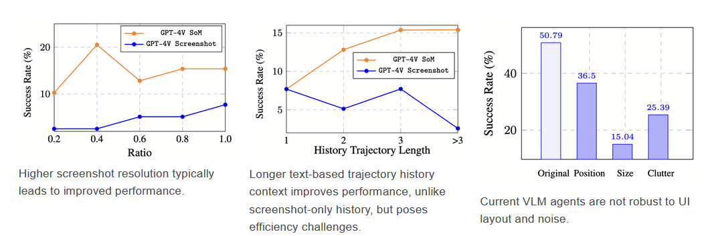
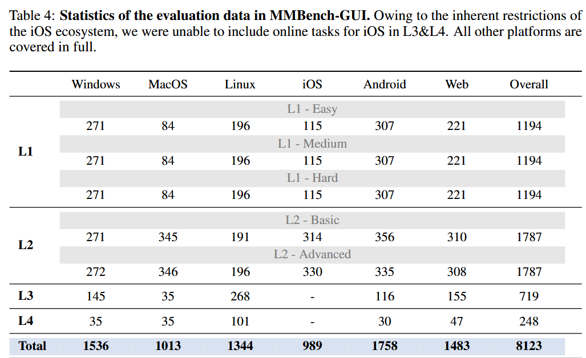
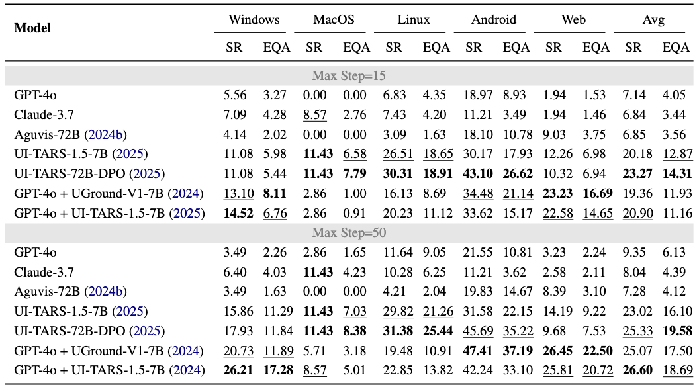
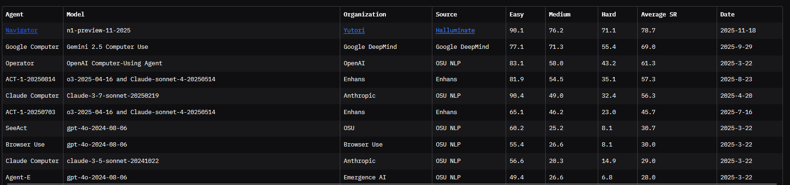

# GUI Agent Searching Phase

## Benchmarks

> [!NOTE] most benchmarks uses VLMEvalKit https://github.com/open-compass/VLMEvalKit "A Toolkit for Evaluating Large Vision-Language Models." - and it is a Python packages

### **OSWorld-Verified** last update: (2025-07-28) - 2.7K starts:
- one of most popular and larg datasets
- *problem* I think it doesn't have public access
- link: https://os-world.github.io/
- paper link: https://arxiv.org/abs/2404.07972 
- github repo: https://github.com/xlang-ai/OSWorld
- target: desktop (Windows, macOS, Linux)
- Tasks span Chrome, LibreOffice, VS Code, Thunderbird, etc..
- metrics: [Task Success Rate (SR)]
- **top agentic models**:
    - HIPPO w/ opus 4.5 (lenovo) SR=74.5
    - UiPath Screen Agent w/ Opus 4.5 SR = 67.1%
    - OS-Symphony w/ GPT-5 (65.8%)
    - GBOX Agent (64.2%)
    - Opus w Sonnet كاسحين
- **top specialized models**:
    -  GUI-Owl-1.5 32B (55.4%) & **Max Steps: 50**
    -  autoglm-os-9b-20250925 (48.0%)
    -  DART-GUI-7B-0924 (40.5%)
    -  DeepMiner-Mano-7B (40.1%)
- **top general models**:
    - sonnet 4.6 (72.1%)
    - kimi 2.5 (63.3%)
    - seed 1.8 by ByteDance
    - EvoCUA by  Meituan LongCat Team (56.7%)
    - UI-TARS  by ByteDance (53.1%)
- **Analysis** (may benfit us)
  

### **MMBench-GUI** Kinda Start of actual work: (2025-07-24)
- github link: https://github.com/open-compass/MMBench-GUI
- techincal report paper: https://arxiv.org/pdf/2507.19478
- hf dataset: https://huggingface.co/datasets/OpenGVLab/MMBench-GUI
- still no publish of leaderboard
- Span [Windows/MacOs/Linux - IOS/Android/Web] - Overall 8123 task with different Levels (Easy/Medium/Hard/Basic/Advanced)
    
- they are doing Hierarchical Evaluation (**4 different levels**)
  1. GUI Content Understanding
  2. GUI Element Grounding
  3. GUI Task Automation
  4. GUI Task Collaboration
      > Real-world task automation frequently requires agents to coordinate actions across multiple appli-
      cations or environments, orchestrating complex workflows that involve heterogeneous interfaces
      and interdependent subtasks

- **Results** for L3 only  -- the github repo contains rest
    

### **Mind2Web**

### **Online-Mind2Web** (2025-11-3)
- github link: https://github.com/OSU-NLP-Group/Online-Mind2Web
- Paper Link (*An Illusion of Progress? Assessing the Current State of Web
Agents*): (https://arxiv.org/pdf/2504.01382)
- **Extra** they introduced WebJudge 7B (LLM as Judge) to automate online evalution and enrich datasets fast & to really evaluate models on the spot 
- **Results**:
  - I think there's something wrong HERE XD
  - maybe because its very recent and have very low submissions
  - but nice it is fist time to **Navigator** model - heil china 
  

