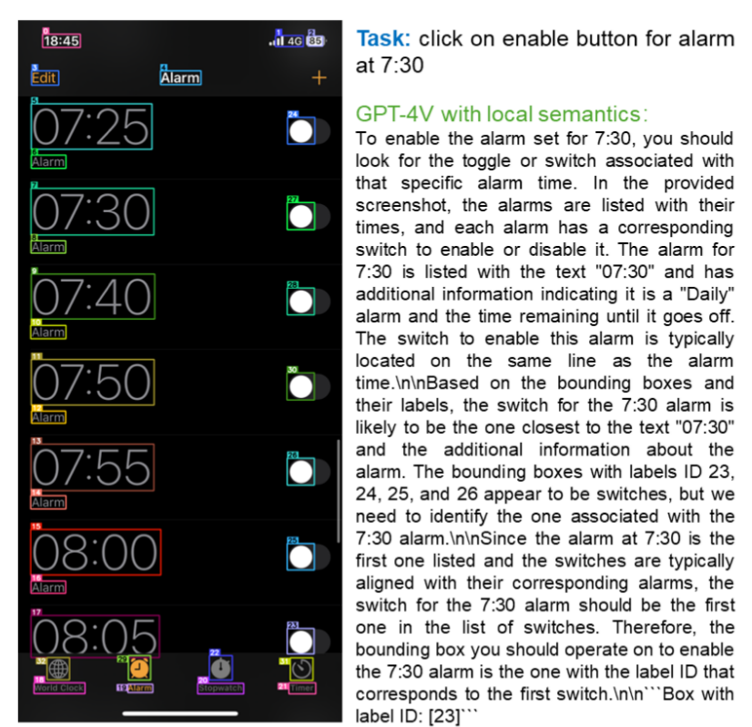
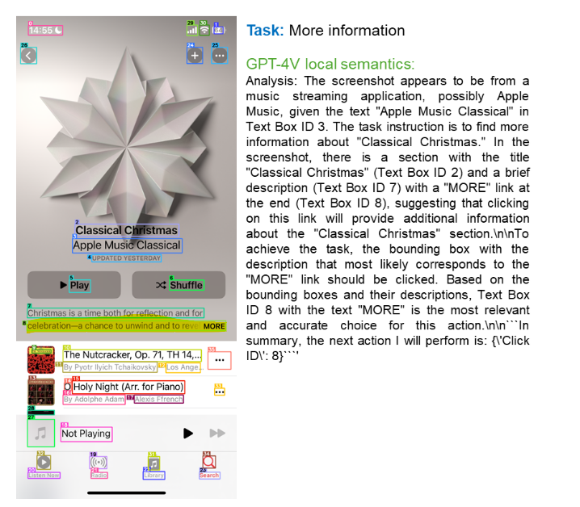

# Omniparser

the paper focuses on parsing ui screenshot, not agentic focus on achieving task.

## it use three models:
1. OCR box detections and using text as caption|description / [`PaddleOCR`](huggingface.co/PaddlePaddle/PaddleOCR-VL-1.5)
2. Icon detection model / `YOLO`
3. Icon caption model to descripe|caption icons / `BLIP-V2 florence`

## Steps:
1. Text OCR BBOXs w Text (**args**: `text_threshold > 0.9` - *confidence threshold to filter results*)
2. Icon detection bboxs (**args**: `box_threshold` - *confidence threshold to filter icon dectection results*)
3. Merge boxs and remove overlapping boxs (**args**: `iou_threshold` - *IoU > iou_threshold -> we keep smaller ones*)
    a. merge icon boxs (if there's much overlapping remove larger ones)
    b. merge icon boxs with text boxs (prioritize text boxs -- *assuming it have more accurate text description*) 
4. Takes Icons by cropping \& resizing it from source images and caption it 
    * some serious problems in cropping they may overlook it
5. Vision Agent
    * I used `Gemini` as it faster
    * I want to try `Qwen-VL` with it

## Observations from [Smoke Test](../notebooks/00-smoke-check-omniparser.ipynb)
* worried about merging algorithm
* the cropping of icons wasn't keep ratio and resize it 64x64
* the cropping of icons \& resizing is better when I resize large side to 128

## Failures (from [paper](../references/solution-OmniParser.pdf))
1. Repeated Icons/Texts

    like alarams page

    

2. Corase Prediction of Bounding Boxes

    the center of text bounding box is not clickable - the right word `more` is clickable
    
    

3. Icon Misinterpretation 

    because the lack of context given and rely only on the cropped and resized icon shape

    > author suggested to train icon caption model that take full context (full screenshot)