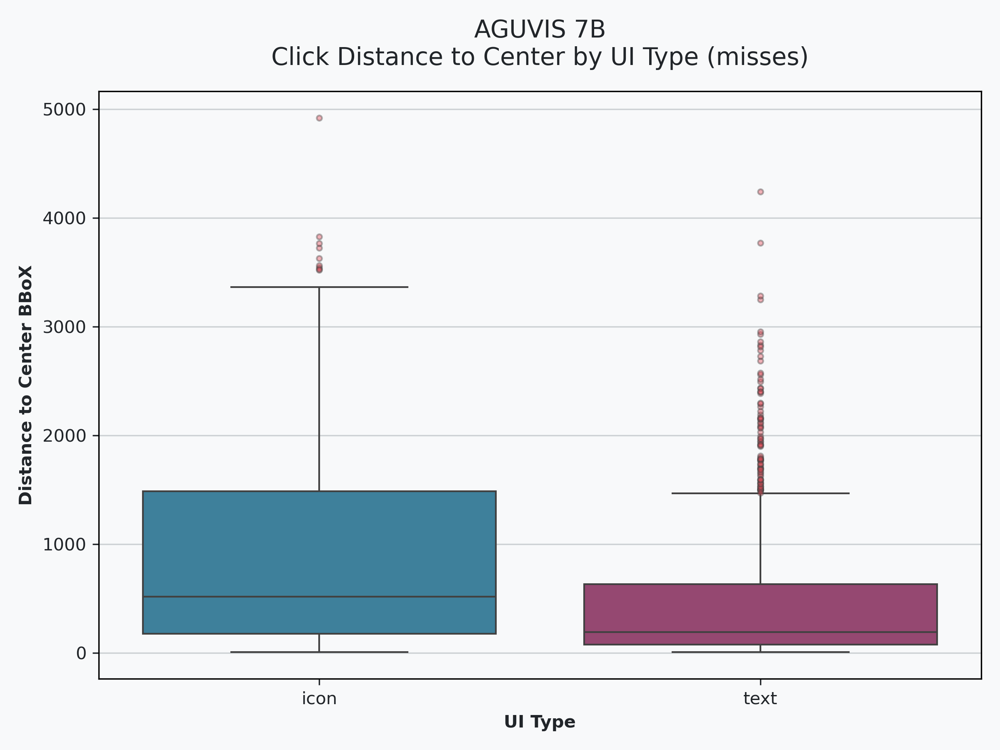
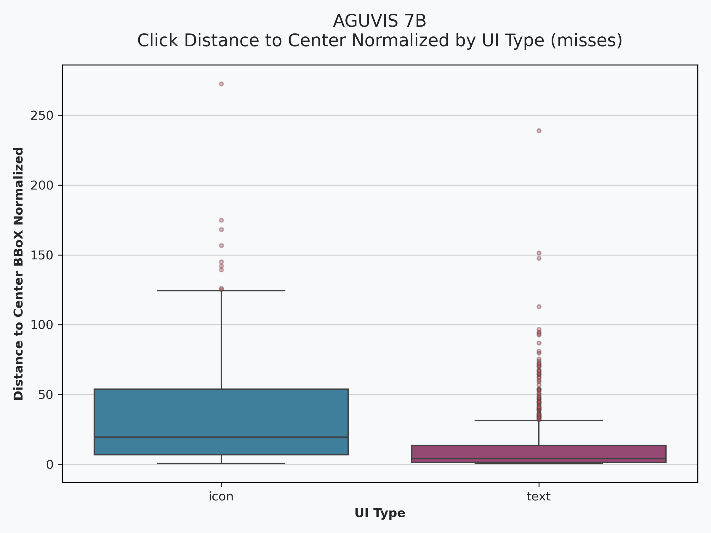
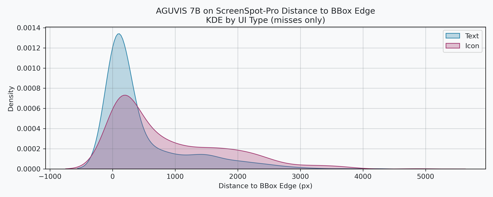
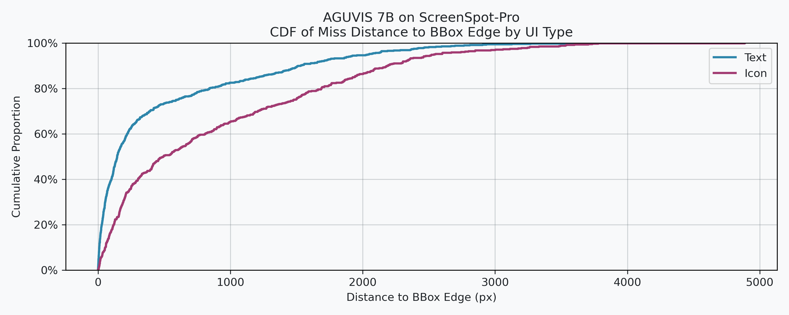
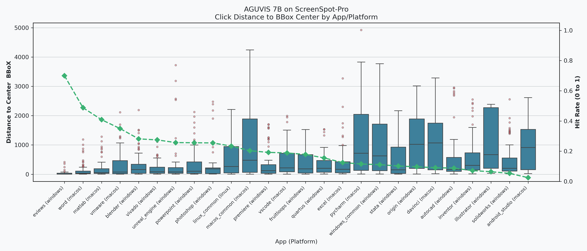

# AGUVIS Results on ScreenSpotPro

- [x] TODO run on failed results due to parsing (as I forget to log raw output in case of error)
- [ ] TODO try to optimize prompt
    - [ ] TODO try to add chinese instructions
    - [x] TODO change prompt for failed due to model output other than click actions
- [ ] TODO try smart resize
- [ ] TODO try to allow thinking
- [ ] ADD analysis to language affect on results (The main problem I don't understand chinese)

## ChangeLog
- 4/22 updated after removing duplicates and rerun on missed images, try prompt enhancement decrease number of error (couldn't parse action to x,y)

## ScreenSpot Pro
the below image describe the distribution of dataset on different applications with different icon types foreach app

## Hit Rate Analysis

- **Hit Accuracy**: `21.069%`
- **Hit Accuracy Per UI-Type**:
    | ui_type   |  hit (%) |
    |:----------|---------:|
    | text      | 31.7199  |
    | icon      |  3.83333 |

- **Hit Accuracy Per Platform**:
    | platform   |     hit |
    |:-----------|--------:|
    | linux      | 23.4043 |
    | macos      | 23.1667 |
    | windows    | 19.5887 |
- **Hit Accuracy Per Application**:
    | app/platform             |  hit (%) |
    |:-------------------------|---------:|
    | eviews (windows)         | 70       |
    | word (macos)             | 48.8095  |
    | matlab (macos)           | 40.8602  |
    | vmware (macos)           | 35       |
    | blender (windows)        | 28.169   |
    | vivado (windows)         | 27.5     |
    | unreal_engine (windows)  | 25.7143  |
    | powerpoint (windows)     | 25.6098  |
    | photoshop (windows)      | 25.4902  |
    | linux_common (linux)     | 23.4043  |
    | macos_common (macos)     | 20.3125  |
    | premiere (windows)       | 19.2308  |
    | vscode (macos)           | 18.8679  |
    | fruitloops (windows)     | 17.8571  |
    | quartus (windows)        | 15.5556  |
    | excel (macos)            | 12.5     |
    | pycharm (macos)          | 11.5385  |
    | windows_common (windows) | 11.1111  |
    | stata (windows)          | 10.2041  |
    | origin (windows)         |  9.67742 |
    | davinci (macos)          |  9.09091 |
    | autocad (windows)        |  8.82353 |
    | inventor (windows)       |  7.14286 |
    | illustrator (windows)    |  6.45161 |
    | solidworks (windows)     |  5.33333 |
    | android_studio (macos)   |  2.5     |
- **Misses Click Shorted Distance to Edge of BBoX**
    |       |   dist_to_edge |
    |:------|---------------:|
    | mean  |       655.878  |
    | std   |       815.087  |
    | min   |         0.24   |
    | 25%   |        73.3023 |
    | 50%   |       248.279  |
    | 75%   |      1041.44   |
    | max   |      4886.73   |
- **Misses Click Distance to Center of BBoX**
    |       |   dist_to_center |
    |:------|-----------------:|
    | mean  |        687.758   |
    | std   |        815.428   |
    | min   |          8.87119 |
    | 25%   |        106.788   |
    | 50%   |        274.618   |
    | 75%   |       1070.8     |
    | max   |       4920.4     |
- **Misses Click Distance to Center of BBoX Normalized**
    |       |   dist_to_center_norm |
    |:------|----------------------:|
    | mean  |             22.3184   |
    | std   |             30.4832   |
    | min   |              0.522438 |
    | 25%   |              2.51029  |
    | 50%   |              8.56868  |
    | 75%   |             30.6922   |
    | max   |            272.647    |

### Visualizations
#### Hit Rate Distribution on ScreenSpot-Pro

#### Hit Rate vs Image Sized for-each App
there's no direct relation between image size and performance

#### Hit Rate vs Ground Truth BBox Area
The ground-truth box area has some low correlation with accuracy of grounding 

### Analysis of Errors By Distance

**we calculate three distances**
1. shorted distance to any edge of bbox
2. distance to center of bbox
3. distance to center of bbox normalized by dimension of bbox
    - meaning if bbox is small it penalize distance more because it miss it more

| Absolute Distance | Normalized Distance |
| :---: | :---: |
|  |  |

| KDE | CDF |
| :---: | :---: |
|  |  |

### Error Analysis
Selecting 101 random sample and label 38 of image with clear errors

1. 15 Erros happen because of *precision the click was actually very close to bbox* [result dir](./results/samples/failed-very-close/)

    (could happen due to rouning or because I didn't smart_resize (i.e resize image to dimensions divided into patch sizes))
    
    also should try to add another metric measure closeness
    

2. 6 Errors happen because *model predicting previouse step from task even it has done* -- *ignoring image context* [result dir](./results/samples/failed-prev-step/)

    maybe if allowed thinking the results will optimized

    

3. 5 Erros because there are multiple Ground Truth [result dir](./results/samples/failed-multiple-gt//)

    

4. 5 Erros because confusion between buttons [result dir](./results/samples/failed-confusion-bet-buttons/)

    

**Other Errors**
- ignoring part of instructions (for-example click on `X` inside `Y`), AGUVIS click on `X`
- ignoring part of image 
- dont understand meaning of icon (espically if it rarly used out-side than programs) for-example davinci most errors due to this
- dont understand task

> [!NOTE] 
> images inside results/samples are compressed so it may appear low quality