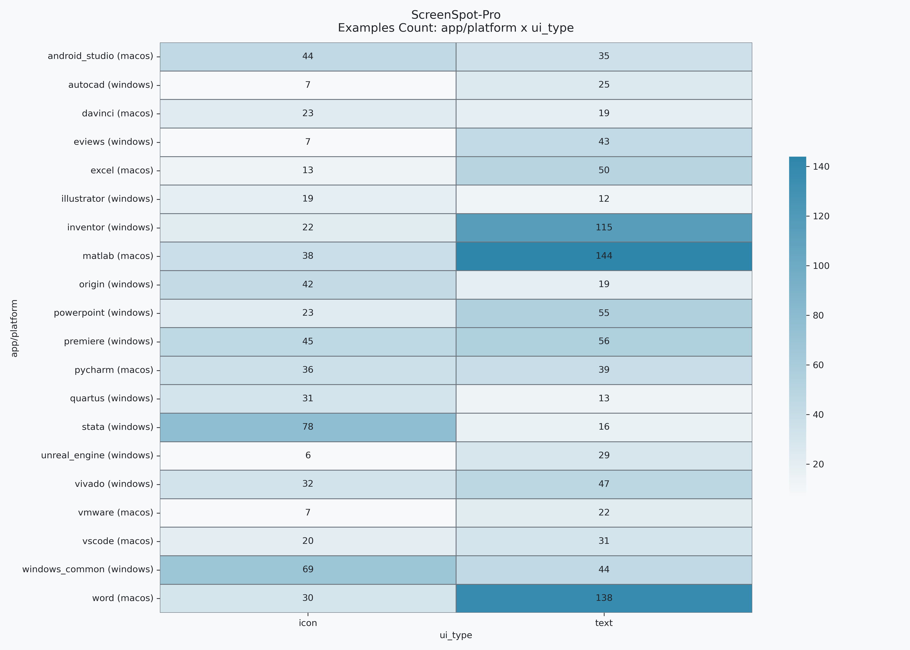
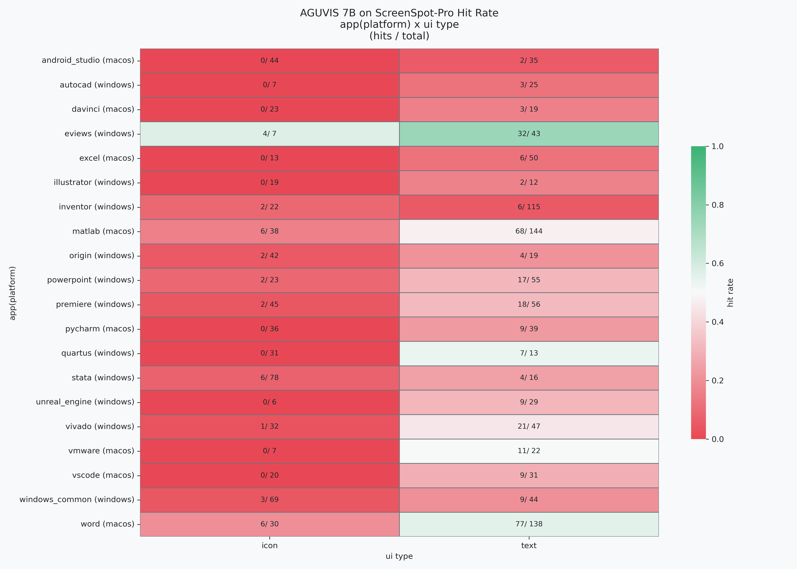
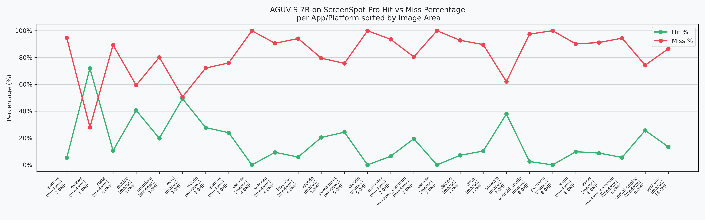
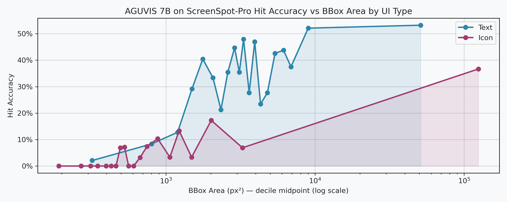
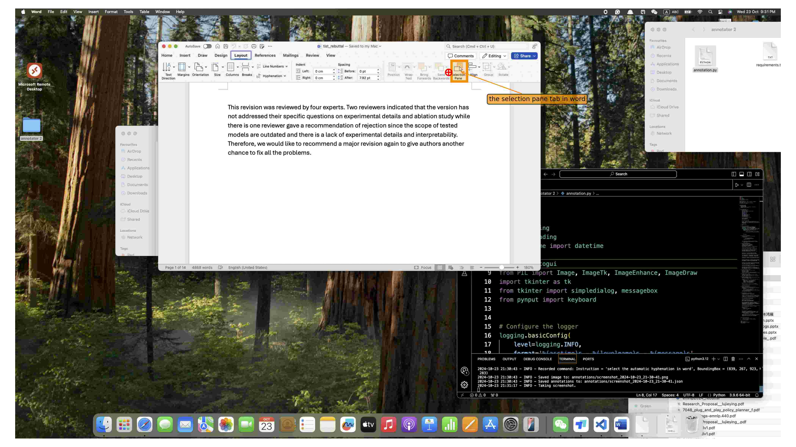
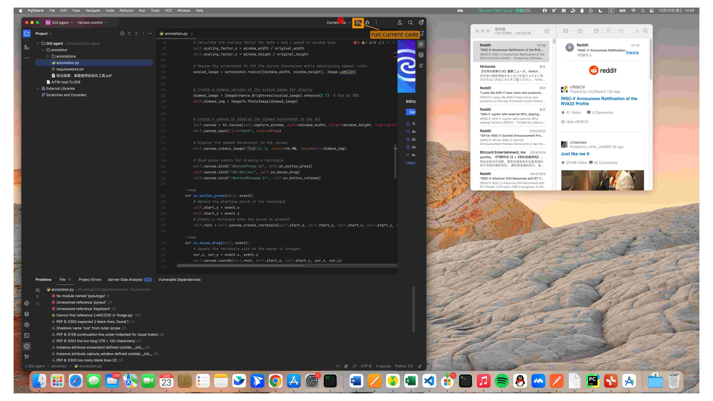
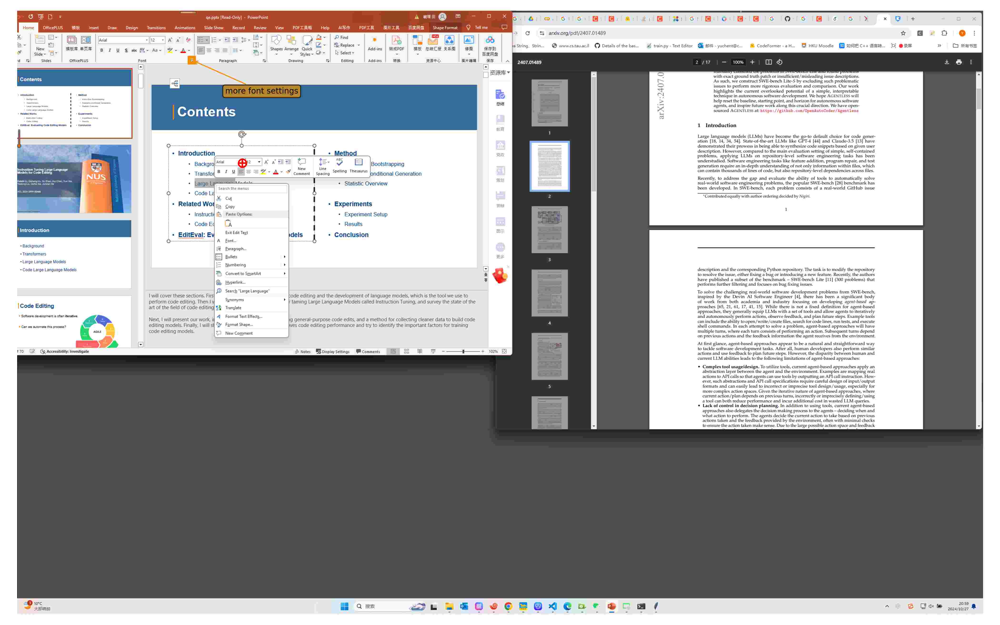
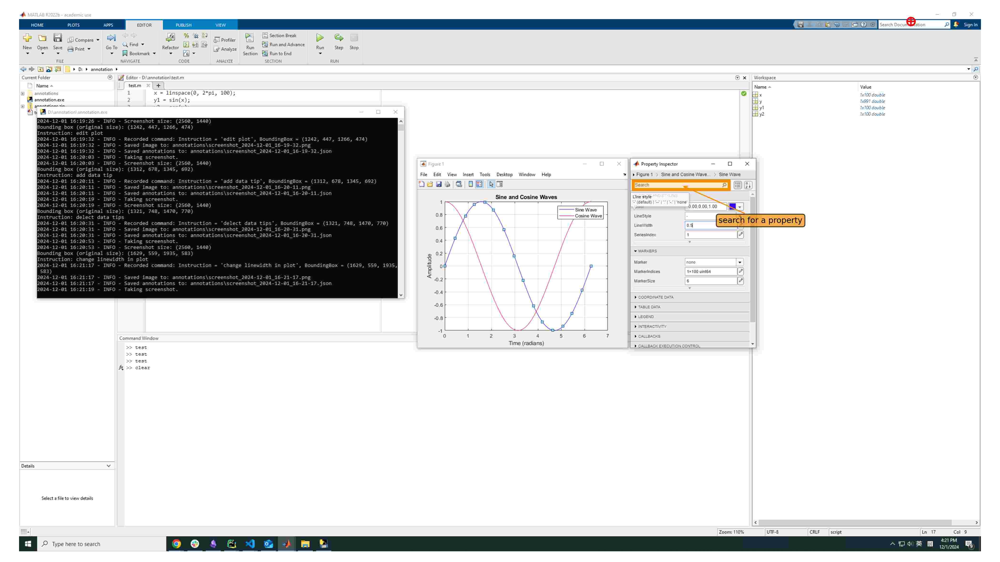

# AGUVIS Results on ScreenSpotPro

- [ ] TODO run on failed results due to parsing (as I forget to log raw output in case of error)
- [ ] TODO try to optimize prompt
    - [ ] TODO try to add chinese instructions
- [ ] TODO try smart resize
- [ ] TODO try to allow thinking
- [ ] ADD analysis to language affect on results (The main problem I don't understand chinese)

## ScreenSpot Pro
the below image describe the distribution of dataset on different applications with different icon types foreach app

## Hit Rate Analysis

- **Hit Accuracy**: `22.7%`
- **Hit Accuracy Per UI-Type**:
    | ui_type   |  hit (%) |
    |:----------|---------:|
    | text      | 33.2983  |
    | icon      |  5.74324 |

- **Hit Accuracy Per Platform**:
    | platform   |     hit |
    |:-----------|--------:|
    | macos      | 28.5922 |
    | windows    | 18.0117 |
- **Hit Accuracy Per Application**:
    | app/platform             |  hit (%) |
    |:-------------------------|---------:|
    | eviews (windows)         | 72       |
    | word (macos)             | 49.4048  |
    | matlab (macos)           | 40.6593  |
    | vmware (macos)           | 37.931   |
    | vivado (windows)         | 27.8481  |
    | unreal_engine (windows)  | 25.7143  |
    | powerpoint (windows)     | 24.359   |
    | premiere (windows)       | 19.802   |
    | vscode (macos)           | 17.6471  |
    | quartus (windows)        | 15.9091  |
    | pycharm (macos)          | 12       |
    | stata (windows)          | 10.6383  |
    | windows_common (windows) | 10.6195  |
    | origin (windows)         |  9.83607 |
    | excel (macos)            |  9.52381 |
    | autocad (windows)        |  9.375   |
    | davinci (macos)          |  7.14286 |
    | illustrator (windows)    |  6.45161 |
    | inventor (windows)       |  5.83942 |
    | android_studio (macos)   |  2.53165 |

### Visualizations
#### Hit Rate Distribution on ScreenSpot-Pro

#### Hit Rate vs Image Sized for-each App
there's no direct relation between image size and performance

#### Hit Rate vs Ground Truth BBox Area
The ground-truth box area has some low correlation with accuracy of grounding 

### Error Analysis
Selecting 101 random sample and label 38 of image with clear errors

1. 15 Erros happen because of *precision the click was actually very close to bbox* [result dir](./results/samples/failed-very-close/)

    (could happen due to rouning or because I didn't smart_resize (i.e resize image to dimensions divided into patch sizes))
    
    also should try to add another metric measure closeness
    

2. 6 Errors happen because *model predicting previouse step from task even it has done* -- *ignoring image context* [result dir](./results/samples/failed-prev-step/)

    maybe if allowed thinking the results will optimized

    

3. 5 Erros because there are multiple Ground Truth [result dir](./results/samples/failed-multiple-gt//)

    

4. 5 Erros because confusion between buttons [result dir](./results/samples/failed-confusion-bet-buttons/)

    

**Other Errors**
- ignoring part of instructions (for-example click on `X` inside `Y`), AGUVIS click on `X`
- ignoring part of image 
- dont understand meaning of icon (espically if it rarly used out-side than programs) for-example davinci most errors due to this
- dont understand task

> [!NOTE] 
> images inside results/samples are compressed so it may appear low quality