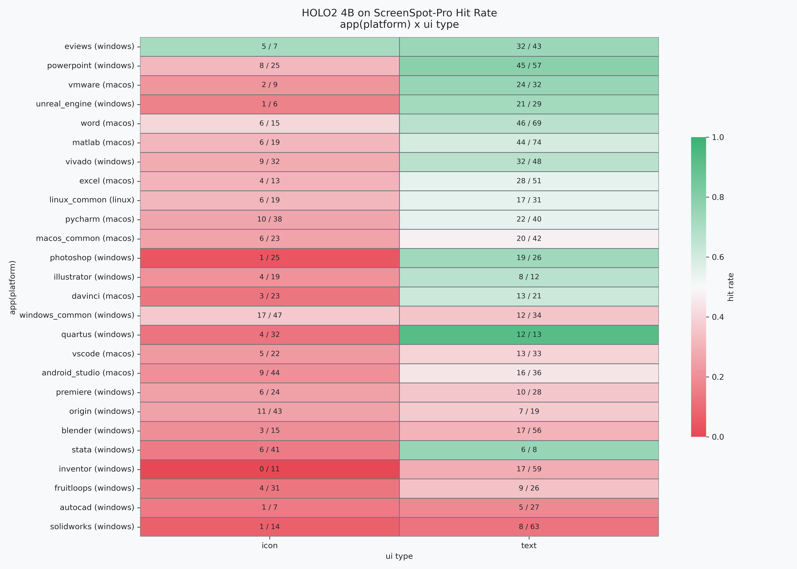
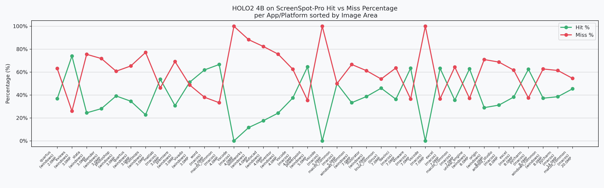
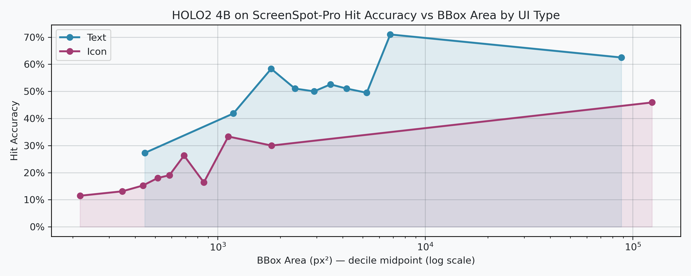
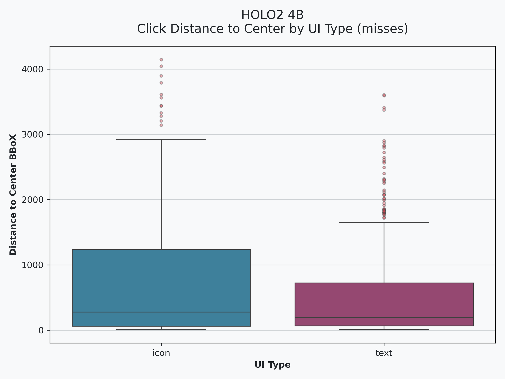
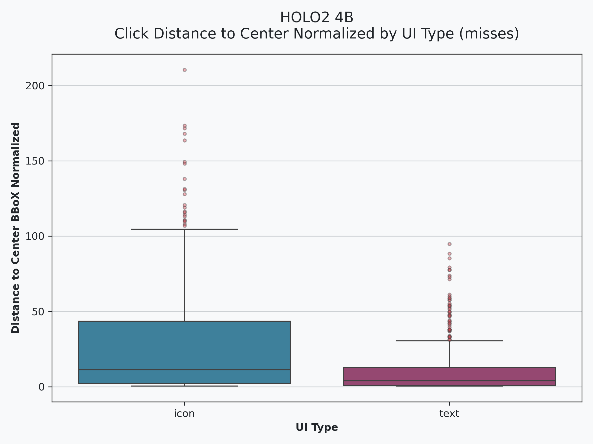
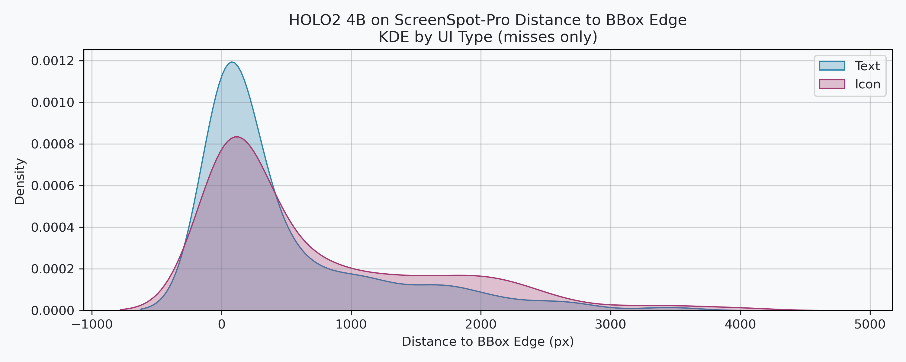
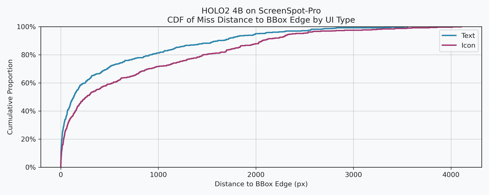
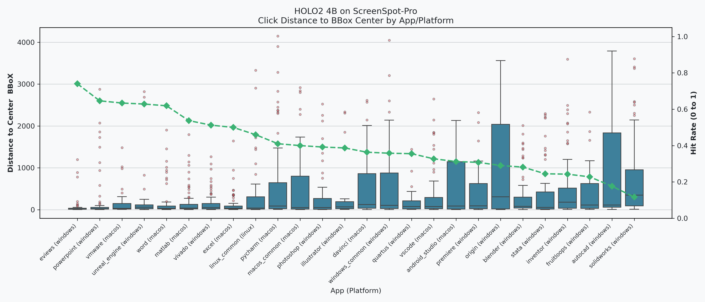

# HOLO2 4B Results on ScreenSpotPro

- [ ] TODO add error analysis
- [ ] TODO ablation study on resizing images effects on hit accuracy

## Hit Rate Analysis
- **Hit Accuracy**: `40.54%`
- **Hit Accuracy Per UI-Type (%)**:
    | ui_type   |     hit |
    |:----------|--------:|
    | text      | 51.4841 |
    | icon      | 22.8477 |

- **Hit Accuracy Per Platform (%)**:
    | platform   |     hit |
    |:-----------|--------:|
    | linux      | 46      |
    | macos      | 45.8609 |
    | windows    | 36.7853 |
- **Hit Accuracy Per Application (%)**:
    | app/platform             |     hit |
    |:-------------------------|--------:|
    | eviews (windows)         | 74      |
    | powerpoint (windows)     | 64.6341 |
    | vmware (macos)           | 63.4146 |
    | unreal_engine (windows)  | 62.8571 |
    | word (macos)             | 61.9048 |
    | matlab (macos)           | 53.7634 |
    | vivado (windows)         | 51.25   |
    | excel (macos)            | 50      |
    | linux_common (linux)     | 46      |
    | pycharm (macos)          | 41.0256 |
    | macos_common (macos)     | 40      |
    | photoshop (windows)      | 39.2157 |
    | illustrator (windows)    | 38.7097 |
    | davinci (macos)          | 36.3636 |
    | windows_common (windows) | 35.8025 |
    | quartus (windows)        | 35.5556 |
    | vscode (macos)           | 32.7273 |
    | android_studio (macos)   | 31.25   |
    | premiere (windows)       | 30.7692 |
    | origin (windows)         | 29.0323 |
    | blender (windows)        | 28.169  |
    | stata (windows)          | 24.4898 |
    | inventor (windows)       | 24.2857 |
    | fruitloops (windows)     | 22.807  |
    | autocad (windows)        | 17.6471 |
    | solidworks (windows)     | 11.6883 |
- **Misses Click Shorted Distance to Edge of BBoX**
    |       |   dist_to_edge |
    |:------|---------------:|
    | mean  |       597.805  |
    | std   |       811.514  |
    | min   |         0.08   |
    | 25%   |        31.1125 |
    | 50%   |       183.23   |
    | 75%   |       907.427  |
    | max   |      4108.87   |
- **Misses Click Distance to Center of BBoX**
    |       |   dist_to_center |
    |:------|-----------------:|
    | mean  |        630.793   |
    | std   |        812.897   |
    | min   |          8.26608 |
    | 25%   |         61.6986  |
    | 50%   |        219.531   |
    | 75%   |        943.874   |
    | max   |       4145.08    |
- **Misses Click Distance to Center of BBoX Normalized**
    |       |   dist_to_center_norm |
    |:------|----------------------:|
    | mean  |              19.7894  |
    | std   |              29.2962  |
    | min   |               0.50534 |
    | 25%   |               1.51467 |
    | 50%   |               6.30661 |
    | 75%   |              26.7998  |
    | max   |             210.468   |
### Visualizations
#### Hit Rate Distribution on ScreenSpot-Pro

#### Hit Rate vs Image Sized for-each App
there's no direct relation between image size and performance

#### Hit Rate vs Ground Truth BBox Area
The ground-truth box area has some low correlation with accuracy of grounding 

### Analysis of Errors By Distance

**we calculate three distances**
1. shorted distance to any edge of bbox
2. distance to center of bbox
3. distance to center of bbox normalized by dimension of bbox
    - meaning if bbox is small it penalize distance more because it miss it more

| Absolute Distance | Normalized Distance |
| :---: | :---: |
|  |  |

| KDE | CDF |
| :---: | :---: |
|  |  |

> this shows that there are many misses very close to GT

