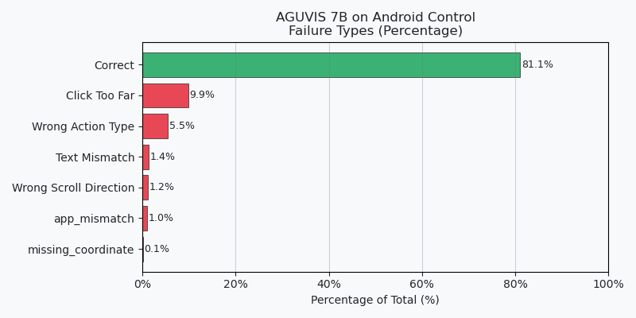
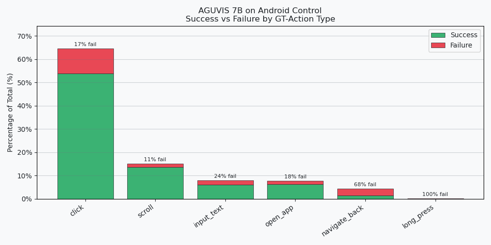
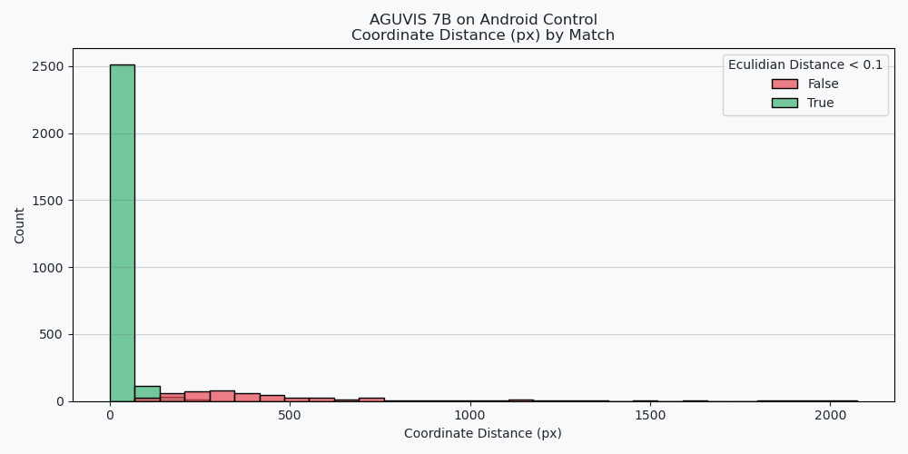
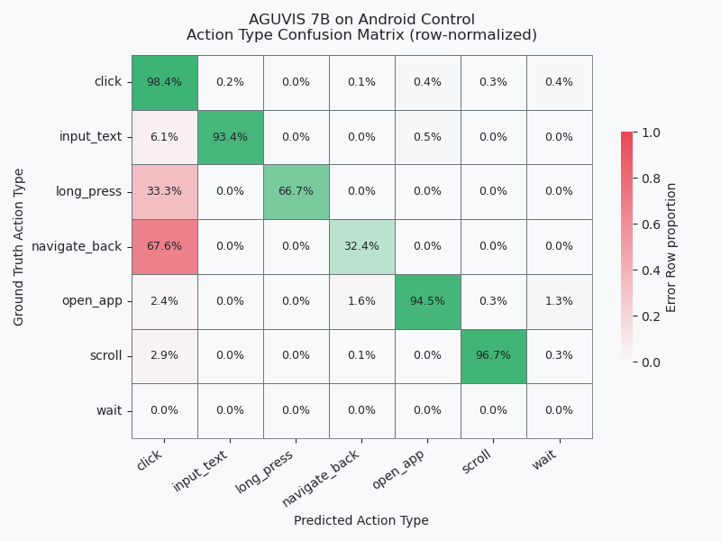

# Expirement

- **Model**: AGUVIS 7B
- **Dataset**: Android Control (5309 steps across N episodes)
- **Date**: `2026-05-07`

## Exclusions
- some results model predict None where we should rerun it later `1` record

## Key Findings — AGUVIS 7B on Android Control (2988 steps)

- **Overall accuracy (threshold = 0.1): 75%**
- **Main failure mode**: coordinate too far from target (`9.9%` of samples)
- Accuracy is threshold-sensitive: drops from **75% → 62%** when tightening from 0.1 → 0.01, indicating many clicks are close but imprecise

### Failure Breakdown

| Failure Reason     | Share  |
|--------------------|--------|
| Correct (ok)       | 81.1%  |
| Coord too far      | 9.9%   |
| Wrong action type  | 5.5%   |
| Text mismatch      | 1.4%   |
| Wrong direction    | 1.2%   |
| App mismatch       | 1.0%   |
| Missing coordinate | 0.08%  |

## Results In Depth

### Accuracy

we compare results, by comparing action types and some params, eg. if same text was typing or if the eculidian distance between two clicks < $Coord Threshold$

**NOTE** we normalize both coordinates to be from 0-1 
| Coord Threshold | Accuracy   |
|:---------------:|:----------|
| 0.1             | 0.75      |
| 0.05            | 0.720719  |
| 0.01            | 0.618942  |
| 0               | 0.2187    |

| failure_reason      | Value     |
|:-------------------:|:---------:|
| ok                  | 0.810784  |
| coord_too_far       | 0.098546  |
| wrong_action_type   | 0.054927  |
| text_mismatch       | 0.013530  |
| wrong_direction     | 0.011712  |
| app_mismatch        | 0.009693  |
| missing_coordinate  | 0.000808  |

### Eculidian Distance

**we choose 0.1 to collect summary of problems**

| coord_match | Value    |
|:-----------:|:--------:|
| True        | 0.844592 |
| False       | 0.155408 |

### Actions Mismatch

| action_type_match | Value    |
|:-----------------:|:--------:|
| True              | 0.945073 |
| False             | 0.054927 |

### Other Metrics Match

| text_match | Value    |
|:----------:|:--------:|
| False      | 0.763959  |
| True       | 0.236041 |

| direction_match | Value    |
|:---------------:|:--------:|
| False           | 0.889628 |
| True            | 0.110372 |

