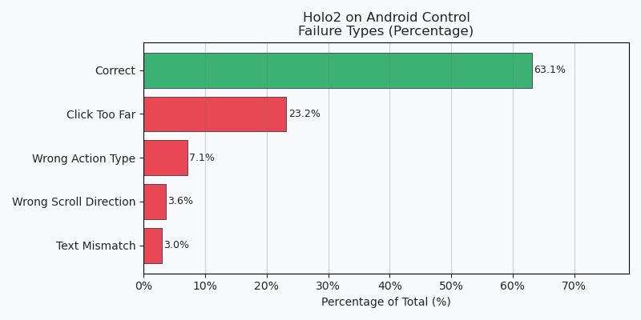
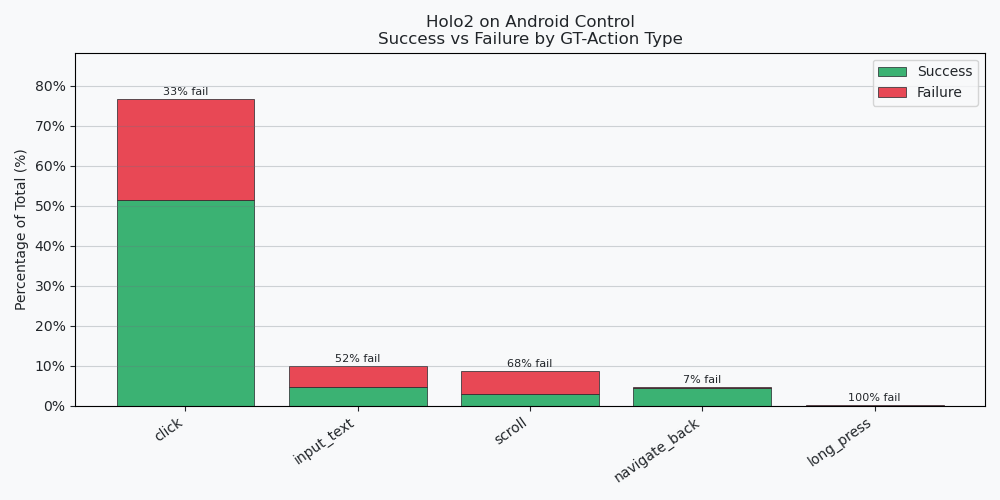
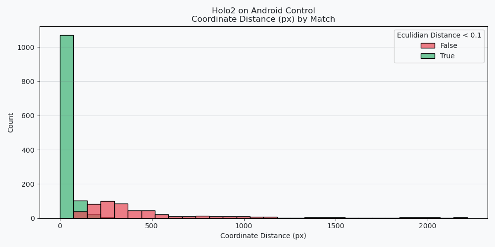
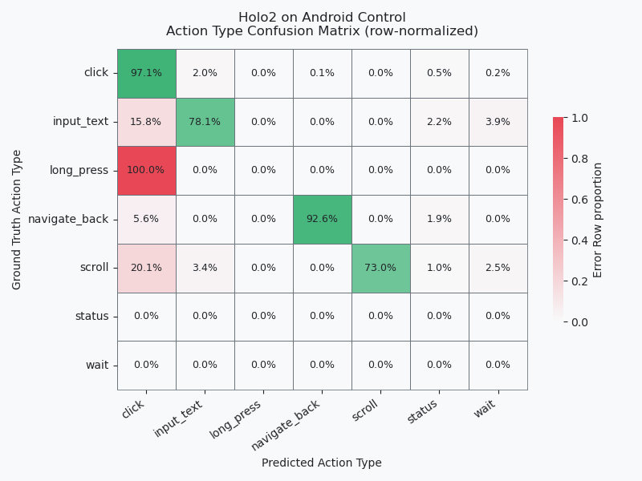

# Expirement

- **Model**: HOLO2 4B
- **Dataset**: Android Control (2988 steps across N episodes)
- **Date**: `2026-05-07`

## Exclusions
- some results model predict None where we should rerun it later `288` record
- since we didnt give context model don't know when if it should `wait`
- model dont predict `open_app` it predict `click` and gt is `open_app` so we cant compare those

- **conculusion** we ignore results when `ground_truth.action_type in ('wait', 'open_app')` (i.e 373 records)

## Key Findings
- Overall accuracy (threshold=0.1): **58.4%**
- Main failure mode: coordinate too far (`23.2%` of all samples)         
- Action type is almost always correct (`92.9%` match) — the bottleneck is localization
- Text and scroll direction perform poorly (52% / 68% failure rate)     

## Results In Depth

### Accuracy

we compare results, by comparing action types and some params, eg. if same text was typing or if the eculidian distance between two clicks < $Coord Threshold$

**NOTE** we normalize both coordinates to be from 0-1 
| Coord Threshold | Accuracy   |
|:---------------:|:----------|
| 0.1             | 0.584443  |
| 0.05            | 0.526429  |
| 0.01            | 0.37731  |
| 0               | 0.074345  |

| failure_reason      | Value    |
|:-------------------:|:--------:|
| ok                  | 0.631285 |
| coord_too_far       | 0.232058 |
| wrong_action_type   | 0.071336 |
| wrong_direction     | 0.035668 |
| text_mismatch       | 0.029652 |

### Eculidian Distance

**we choose 0.1 to collect summary of problems**

| coord_match | Value    |
|:-----------:|:--------:|
| True        | 0.683191 |
| False       | 0.316809 |

### Actions Mismatch

| action_type_match | Value    |
|:-----------------:|:--------:|
| True              | 0.928664 |
| False             | 0.071336 |

### Other Metrics Match

| text_match | Value    |
|:----------:|:--------:|
| False      | 0.52193  |
| True       | 0.47807  |

| direction_match | Value    |
|:---------------:|:--------:|
| False           | 0.676471 |
| True            | 0.323529 |

